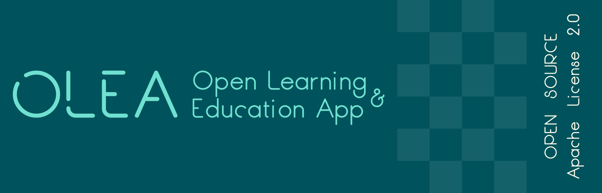
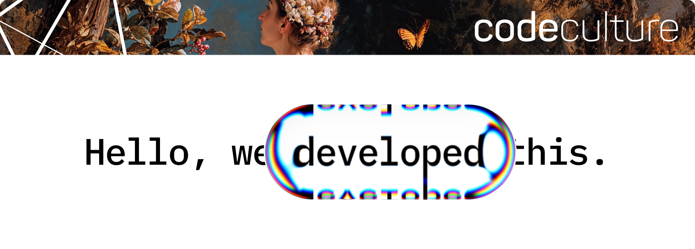

# OLEA (zuvor OpenASiST)

Die Open-Source-Version der App ist derzeit in Arbeit. Alle notwendigen Informationen werden Schritt für Schritt hinzugefügt und in der Roadmap festgehalten.

## Roadmap

- [ ] Projektbeschreibung hinzufügen
- [ ] Beitragsrichtlinien hinzufügen
- [ ] Verhaltenskodex hinzufügen
- [ ] Projektstruktur erläutern
- [ ] Build-Anweisungen hinzufügen
- [ ] Server-Api-Dokumentation hinzufügen

## Mit ❤️ gemacht vom OLEA Team
TU Chemnitz\
HTWK Leipzig\
BPS Bildungsportal Sachsen GmbH\
codeculture

<!-- Wenn alle Logos der Mitwirkenden verfügbar sind, werden diese hier platziert:
[Logo TU Chemnitz]
[Logo HTWK Leipzig]
[Logo BPS]

-->

## Mitwirken

Jeder ist herzlichst eingeladen an der Entwicklung der OLEA (Open Learning and Education Application) mitzuwirken.
Es werden Personen aus allen Bereichen gesucht, so dass das OLEA-Team alle Beiträge mit Freuden annimmt.
Hast du eine kreative Idee, die noch nicht in der OLEA umgesetzt ist?
Dir ist ein Fehler oder eine Absturzursache aufgefallen?
Dann erstelle einen Issue, damit die Community über deinen Vorschlag oder Fehlerbericht diskutieren kann.
Ist in deinem Eifer bereits Code entstanden und du möchtest deine Arbeit in das Projekt mit einfließen lassen?
Stelle uns deinen Beitrag als Feature-Branch und/oder Merge-Request zur Verfügung.

## Lizenz

Dieses Projekt verwendet die Apache-Lizenz Version 2.0. Lesen Sie die [LICENSE](LICENSE) für weitere Informationen.

